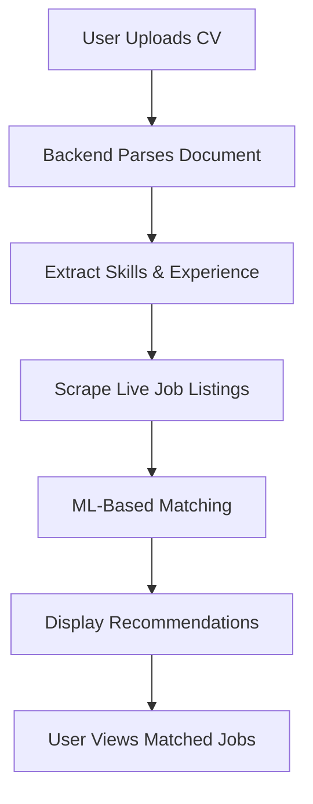

# AI-Based Resume Extractor and Job Recommender

[](https://www.python.org/downloads/)
[](https://reactjs.org/)
[](https://tailwindcss.com/)
[](https://vitejs.dev/)
[](https://fastapi.tiangolo.com/)
[](https://selenium.dev/)
[](https://scrapy.org/)
[](#license)

> An intelligent CV parsing and job recommendation system that helps job seekers find relevant opportunities using AI and machine learning.

## Table of Contents

- [Project Background](#project-background)
- [Features](#features)
- [Technologies Used](#technologies-used)
- [Project Structure](#project-structure)
- [System Requirements](#system-requirements)
- [Getting Started](#getting-started)
- [How It Works](#how-it-works)
- [Supported File Formats](#supported-file-formats)
- [Notes](#notes)
- [Contact](#contact)
- [License](#license)

## Project Background

During conversations with university seniors and fresh graduates, a recurring problem was highlighted: the difficulty of finding relevant job opportunities after graduation. Many individuals reported spending weeks or even months browsing through online job portals, reading listings manually, and often applying to jobs that did not match their skills or qualifications.

### Key Problems Identified:
1. **Job mismatch** – job listings often did not align with their experience or education
2. **Time-consuming process** – manually searching and filtering jobs was exhausting and inefficient

### Our Solution:
A **CV Parser and Job Recommender System** that uses AI to automatically parse resumes, scrape live job listings, and provide intelligent job recommendations based on user profiles.

## Features

- **Resume Upload & Parsing** - Support for PDF/DOCX formats
- **NLP-Powered Extraction** - Extract skills, experience, and education automatically
- **Live Job Scraping** - Real-time job listings from multiple sources
- **Smart Matching** - ML-based job recommendation engine
- **User Authentication** - Secure login system with Supabase
- **Responsive UI** - Modern, intuitive interface

## Technologies Used

### Frontend
- **React** + **Vite** - Modern frontend framework
- **Tailwind CSS** - Utility-first CSS framework
- **Supabase** - Authentication and database

### Backend
- **FastAPI** - High-performance web framework
- **scikit-learn** - Machine learning library
- **pandas** - Data manipulation and analysis
- **Scrapy** - Web scraping framework
- **Selenium** - Browser automation

## Project Structure

```
root/
│
├── frontend/          # React + Tailwind + Supabase
│   ├── src/
│   ├── public/
│   └── package.json
│
└── backend/           # FastAPI + ML + Scraping
    ├── app/
    ├── requirements.txt
    └── main.py
```

**Note:** Open the entire root folder in Visual Studio Code for the best development experience.

## System Requirements

- **Python 3.8+**
- **Node.js** and **npm**
- **Google Chrome** browser
- **ChromeDriver** (installed and added to system PATH)
- **Visual Studio Code** or another code editor

## Getting Started

### Backend Setup

1. **Navigate to backend directory:**
   ```bash
   cd backend
   ```

2. **Create virtual environment:**
   ```bash
   python -m venv venv
   ```

3. **Activate environment:**
   
   **Windows:**
   ```bash
   .\venv\Scripts\activate
   ```
   
   **macOS/Linux:**
   ```bash
   source venv/bin/activate
   ```

4. **Install dependencies:**
   ```bash
   pip install -r requirements.txt
   ```

5. **Start FastAPI server:**
   ```bash
   uvicorn app.main:app --reload
   ```

   **Backend will be available at:** `http://localhost:8000`

### Frontend Setup

1. **Navigate to frontend directory:**
   ```bash
   cd frontend
   ```

2. **Install dependencies:**
   ```bash
   npm install
   ```

3. **Start development server:**
   ```bash
   npm run dev
   ```

   **Frontend will be available at:** `http://localhost:5173`

## How It Works



1. **User uploads a CV** (PDF/DOCX format)
2. **Backend parses** the document and extracts relevant details
3. **Live job listings** are scraped from job portals
4. **Machine Learning** compares CV data with job descriptions
5. **Matched jobs** are sent to frontend and displayed to user

## Supported File Formats

- **PDF** - Portable Document Format
- **DOCX** - Microsoft Word Document

## Notes

**Important:**
- Both backend and frontend servers must be running simultaneously
- Ensure ChromeDriver matches your installed Chrome version
- Supabase is used for handling user authentication and sessions

## Contact

**Kamran Ahmed**  
Email: [kamranahmed7602@gmail.com](mailto:kamranahmed7602@gmail.com)

If you encounter any issues or have suggestions, feel free to reach out!

## License

**All Rights Reserved**  
© 2024 Kamran Ahmed. 

This project is for educational and research purposes. Unauthorized use, reproduction, or distribution of this project or its contents is strictly prohibited without prior written permission from the author. Contact the author for commercial use.

---
